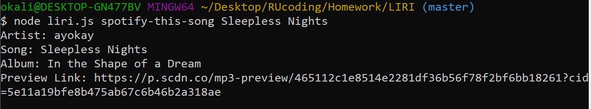

# LIRI

Liri is an Language Interpretation and Recognition Interface, similiar to SIRI. LIRI is a command line node app that takes in parameters and gives you back data.

Liri uses the commands (movie-this, concert-this, spotify-this-song, and do-what-it-says). Each command returns a different result using APIs to provide accurate information that is requested by the user from the terminal/bash window. The user can request information on movies, songs, and concert details for specific artists.

Example of how LIRI works: https://youtu.be/_FpYNp-b1xg

## movie-this
This command returns information from the `axios` package to retrieve data from the OMDB API. From this API, I selected specific information that I wanted to be displayed to the user once they input a movie.

Additionally, if the user forgets to put a movie in the command line, I choose to have the movie, Mr. Nobody, return the same information as if the user included a movie in the search. 

## concert-this
This command returns concert details from the `axios` package from the Bands in Town Artist Events API. The user inputs an artist and I chose the following information to be output.

## spotify-this-song
This command returns information from the Spotify API. Two API keys were required to pull the information, which I have placed in a .env file to keep them hidden. I have choosen the following information to populate when the command is run with the user's song choice. 

If the user does not input a songg. The following data will be returned for the song "The Sign" by Ace of Base.

## do-what-it-says
This command uses the built in `fs` node package to read random.txt and call one of LIRI's other three commands. The command that I put in the random.txt file is spotify-this-song for "I Want it that Way" by the Backstreet Boys.

